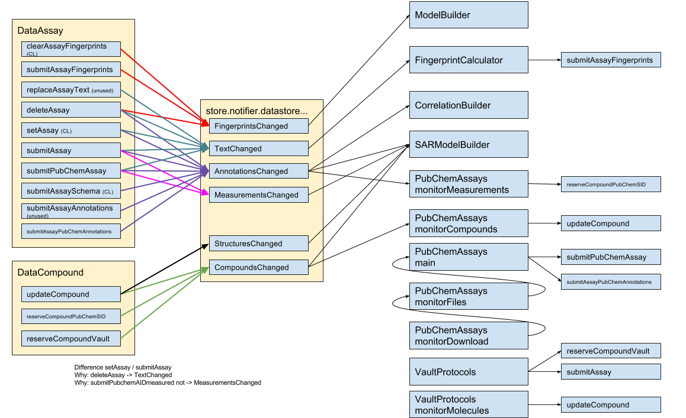

- datastoreTextChanged: triggers FingerprintCalculator
- datastoreFingerprintsChanged: triggers ModelBuilder
- datastoreAnnotationsChanged: triggers CorrelationBuilder and SARModelBuilder
- datastoreMeasurementsChanged: triggers PubChemAssays.monitorMeasurements and SARModelBuilder
- datastoreCompoundsChanged: triggers PubChemAssays.monitorCompounds and SARModelBuilder
- datastoreStructuresChanged: triggers SARModelBuilder

- DataAssay.deleteAssay -> (datastoreTextChanged, datastoreFingerprintsChanged, datastoreAnnotationsChanged)
- DataAssay.replaceAssayText -> (datastoreTextChanged)
- DataAssay.setAssay -> (datastoreTextChanged, datastoreAnnotationsChanged)
- DataAssay.submitAssay -> (datastoreTextChanged, datastoreAnnotationsChanged, datastoreMeasurementsChanged)
- DataAssay.submitPubChemAssay -> (datastoreTextChanged, datastoreAnnotationsChanged, datastoreMeasurementsChanged)
- DataAssay.submitAssaySchema -> (datastoreAnnotationsChanged)
- DataAssay.submitAssayAnnotations -> (datastoreAnnotationsChanged)
- DataAssay.submitAssayPubChemAnnotations -> (datastoreAnnotationsChanged)
- DataAssay.clearAssayFingerprints -> (datastoreFingerprintsChanged)
- DataAssay.submitAssayFingerprints -> (datastoreFingerprintsChanged)
- DataCompound.updateCompound -> (datastoreCompoundsChanged, datastoreStructuresChanged)
- DataCompound.reserveCompoundPubChemSID -> (datastoreCompoundsChanged)
- DataCompound.reserveCompoundVault -> (datastoreCompoundsChanged)

